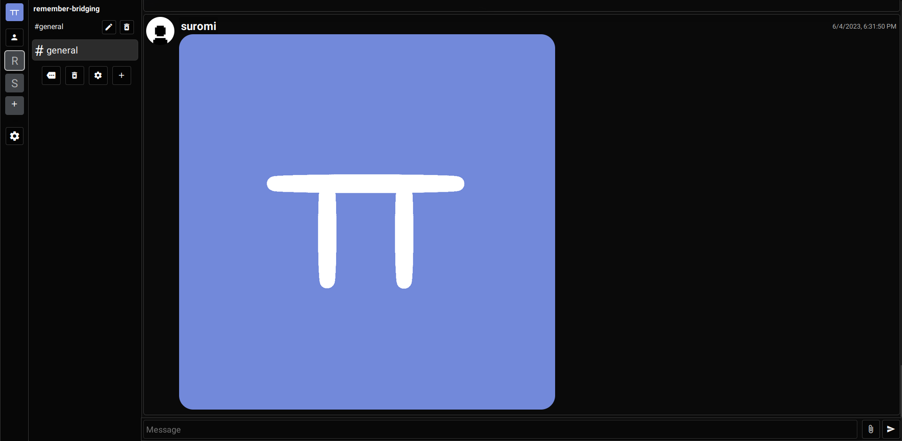

---

  

⚠️  **__DISCLAIMER__** ⚠️

"Remember" is a fork of Roomber (https://github.com/roomber-dev/roomber). The original project belongs to Niko (aka. neksodebe) and SomeEver.
"Remember" is not the original version but is simply a continuation of the already existing project - Roomber.

Niko (aka. neksodebe) - https://neksodebe.github.io/ https://github.com/neksodebe
SomeEver - https://github.com/somenever

# How to update

First, go to the server folder, then in config.js, put the MongoDB URL. Next, write all your client code in the src/client/ folder, then when you wanna `git push` or test the app, run `node obfuscator.js` in the console ! client/Remember.js should update with the obfuscated code.

Remember, when you make a new JS file in src/client/, remember to put it in the JSON object found in `obfuscate.js`. Add it in the order you want it to load.
And as always, before you `git push`, always test!

# Screenshots

# To-do

- [x] Voice calls
- [x] Video calls
- [ ] Screensharing
- [x] Desktop App
- [ ] Mobile App

# Credits

- neksodebe (Founder and Programmer of Roomber (original project) )
- SomeEver (Programmer of roomber (original project) )
- OlxsiU (Graphic Designer of roomber (original project) )
- Suromi (Continuing Roomber under a fork)
