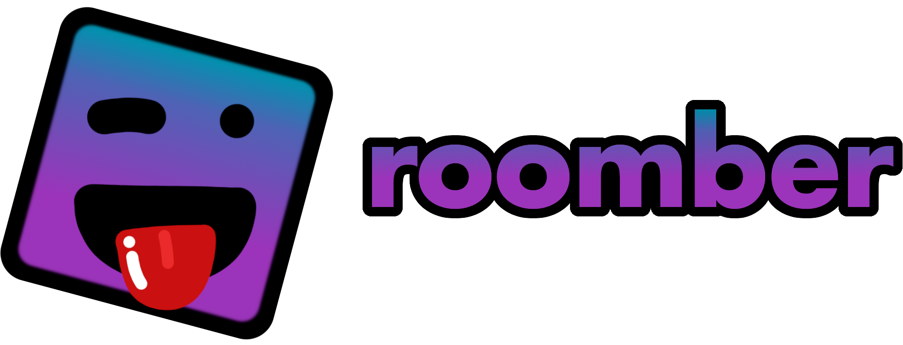

---

  

Create a free Roomber account and discover a new messaging app that's better than anything else out there. Roomber is a fun way to talk with your friends and stay connected.

# How to build

If you want to serve Roomber with minified code, here are the steps to do so:

1. Run `npm run build` to pack the code and produce a client/Roomber.js file.
2. Run `npm run serve` to run the server. It will use the obfuscated code.

If you just want to test out some changes, use `npm run dev`. This will not pack the code.

# Screenshots

# To-do

- [x] Voice calls
- [x] Video calls
- [ ] Screensharing
- [ ] Roomber Xtra (paid subscription)
- [x] Desktop App
- [ ] Mobile App

# Made by

- neksodebe (Founder and Programmer)
- someever (Programmer)
- OlxsiU (Graphic Designer)
